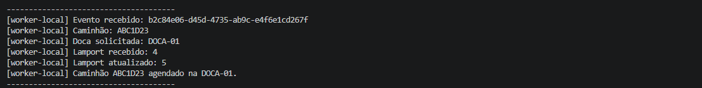

# LogiTrack Express - Orquestração de Frota Logística

**Faculdade Multivix**  
**Disciplina:** Programação Distribuída e Paralela  
**Avaliação Processual 2026/2**

## 👥 Equipe (Grupo 8)
* Geanio Junior Fontoura Moreira; Matrícula: 6-2210555
* João Rafael Matos Azevedo; Matrícula: 6-2210015
* João Neto Fontoura Moreira; Matrícula: 6-2210554
* Lucas Gueler Azevedo; Matrícula: 6-2211824

## 📦 Domínio do Negócio
**Tema 7 - LogiTrack Express**  
Plataforma de recebimento contínuo de telemetria GPS e alocação dinâmica de docas de descarregamento para caminhões em centros de distribuição operando 24h.

## 🏗️ Arquitetura e Fluxo de Mensagens
O sistema implementa o padrão "A Metrópole Resiliente", contendo as seguintes camadas:
1. **Gateway (gRPC):** Ponto de entrada non-blocking para os clientes.
2. **Fila de Mensagens (Apache Kafka):** Desacoplamento e absorção de picos de carga.
3. **Workers Replicados:** Consumidores concorrentes com sincronização via Relógio Lógico de Lamport e eleição de líder (Bully).
4. **Persistência (PostgreSQL):** Banco de dados relacional garantindo exclusão mútua distribuída.

graph TD
    Client["Cliente / Simulador (Caminhão)"] -->|gRPC / Porta 50051| Gateway["Gateway / Ponto de Entrada"]
    Gateway -->|Publicação de Eventos| Kafka["Apache Kafka (Fila de Mensagens)"]
    Kafka -->|Consumo Concorrente| W1["Worker 01 (Bully / Lamport)"]
    Kafka -->|Consumo Concorrente| W2["Worker 02 (Bully / Lamport)"]
    W1 -.->|Eleição de Líder| W2
    W1 -->|Persistência e Exclusão Mútua| DB[(PostgreSQL)]
    W2 -->|Persistência e Exclusão Mútua| DB

## 🚀 Guia de Execução Local

### Pré-requisitos
* Node.js v24+
* Docker e Docker Compose instalados

### Passo a Passo

**1. Subir a Infraestrutura (Banco de Dados e Mensageria)**  
No terminal, na raiz do projeto, execute:  
```bash
docker compose up -d
```

**2. Instalar Dependências**  
```bash
npm install
npm install -D tsx
```

**3. Iniciar o Ponto de Entrada (Gateway)**  
Em um novo terminal, inicie o servidor gRPC:  
```bash
npx tsx src/gateway/server.ts
```

**4. Iniciar os Trabalhadores (Workers)**  
Abra múltiplos terminais (recomendado 2 ou 3) e rode o comando abaixo em cada um deles para iniciar os workers e observar a Eleição do Valentão (Bully):  
```bash
npx tsx src/workers/worker.ts
```

**5. Simular um Cliente (Caminhão)**  
Em um novo terminal, simule a chegada de um caminhão para ver o fluxo completo sendo processado:  
```bash
npx tsx src/client/simulate-client.ts
```

## 📸 Evidências de Execução
Abaixo estão as comprovações do sistema distribuído operando com sucesso:

**Eleição de Líder (Bully):**  
)

**Atualização do Relógio de Lamport:**  
![Evidência Lamport]

## 🤖 Declaração de Uso de IA
Declaramos que ferramentas de Inteligência Artificial Generativa (Gemini) foram utilizadas neste projeto exclusivamente como suporte ao processo de aprendizagem, atuando como um recurso complementar. 

**Forma de utilização:**
* **Depuração de erros (Debugging):** Auxílio na identificação e correção de violações de restrição (`not-null`) nas tabelas `trucks`, `dock_schedules` e `audit_events` do PostgreSQL através da implementação da função geradora de UUIDs nativa.
* **Refatoração Lógica:** Suporte na estruturação e sintaxe para a implementação do Algoritmo do Valentão (Bully) diretamente no banco de dados para coordenar a eleição dos workers de forma distribuída.